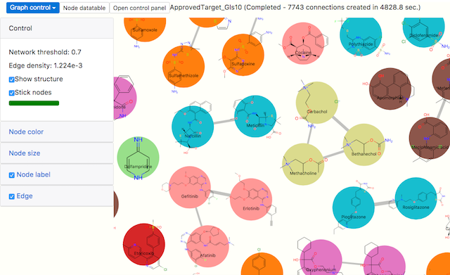
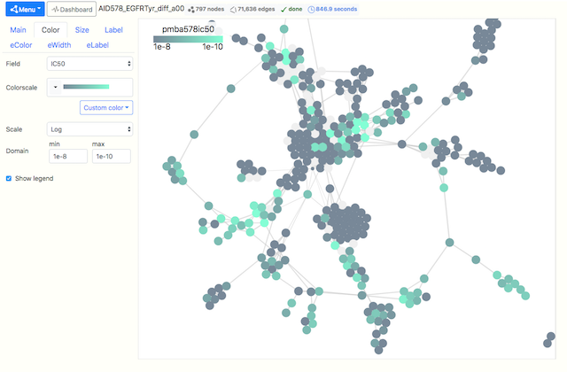

similarity-network
================

https://mojaie.github.io/similarity-network/network.html

- web interface for similarity network visualization
- based on D3.js
- simple JSON format spec file for data import

Supported browsers
--------------------

- Google Chrome 113+

License
--------------

[MIT license](http://opensource.org/licenses/MIT)

Copyright
--------------

(C) 2022-2023 Seiji Matsuoka
